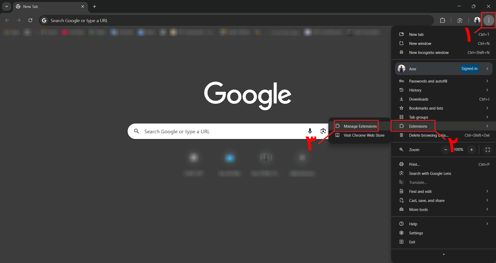
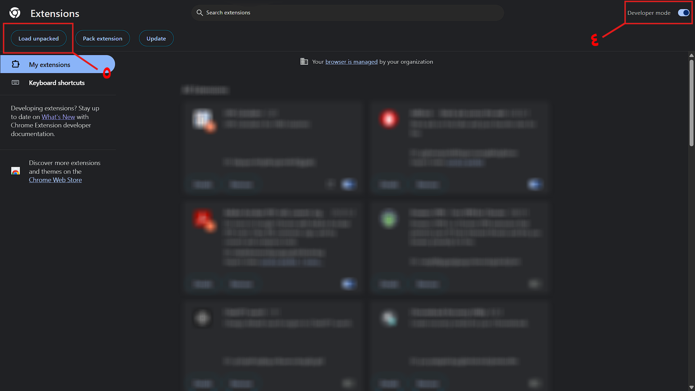

<p align="center">
  <a href="https://myu.hnu.edu.eg/dashboard" target="_blank" rel="noreferrer">
    
  </a>

  <p align="center">
    Chrome Extension that improves the HNU MyU dashboard UI and calculates GPA/CGPA correctly.
    <br>
    <a href="https://myu.hnu.edu.eg/dashboard" target="_blank" rel="noreferrer">Open MyU Dashboard</a>
    ·
    <a href="../../issues/new?template=bug.md">Report bug</a>
    ·
    <a href="../../issues/new?template=feature.md&labels=feature">Request feature</a>
  </p>
</p>

---

## Table of contents

- [Quick start](#quick-start)
- [Features](#features)
- [How it works](#how-it-works)
- [What's included](#whats-included)
- [Notes](#notes)
- [Bugs and feature requests](#bugs-and-feature-requests)
- [Contributing](#contributing)
- [License](#license)

---

## Quick start

### 1) Download / Clone
- Download the ZIP or clone the repo.

### 2) Load the extension in Chrome
1. Open `chrome://extensions`
2. Enable **Developer mode**
3. Click **Load unpacked**
4. Select the project folder

<p align="center">
  
  </a>


<p align="center">
  
  </a>


### 3) Use it
1. Go to:
   - `https://myu.hnu.edu.eg/dashboard`
2. Open the extension popup
3. Click **Run**

> If you run it on another website, the extension will show a warning and a button that takes you to the dashboard.

---

## Features

### UI Improvements
- Clean GPA/Grades summary layout:
  - **Left**: GPA + Term Marks
  - **Right**: CGPA + Cumulative Marks
- Terms are automatically sorted:
  - By year (2023, 2024, 2025…)
  - Inside each year: **FALL → SPRING → SUMMER**

### Accurate Calculations
- **UN31-Math0** is ignored completely:
  - Not included in GPA / CGPA
  - Not included in marks
  - Not included in credit hours
- **GPA (Term)** is calculated from the current term only.
- **CGPA (Cumulative)** handles repeated courses correctly:
  - If a course was taken multiple times, CGPA counts **only the highest attempt**
  - Older attempts are treated as if they don’t exist in CGPA

### Progress Tracking
- Registered Hours (Term)
- Passed Hours (Term)
- Completed Hours (Cumulative)
- Remaining Hours out of **138**

---

## How it works

- The extension injects a content script into the MyU dashboard page.
- It reads the grades/subjects table(s), normalizes the data, and:
  - Builds a clean summary UI
  - Calculates GPA for the selected term
  - Calculates CGPA cumulatively using the “best attempt” rule for repeated courses
  - Excludes UN31-Math0 everywhere
- It does **not** modify your grades or the backend — it’s UI + calculations only.

---

## What's included

```text
.
├── assets/
│   ├── css/
│   │   └── style.css
│   ├── img/
│   │   ├── Big_logo.png
│   │   ├── favicon.png
│   │   └── logo.png
│   ├── instructions/
│   │   ├── Page_1.png
│   │   └── Page_2.png
│   └── js/
│       └── popup.js
├── MyriadArabic.woff2
├── warning.png
├── content.js
├── manifest.json
├── popup.html
└── README.md

```

---

## Notes

* Total required hours are set to **138** in the code.
* This project is intended for **HNU MyU Dashboard** only.

---

## Bugs and feature requests

If you found a bug or want a new feature:

* Search existing issues first
* Then open a new one:

  * Bug: `../../issues/new?template=bug.md`
  * Feature: `../../issues/new?template=feature.md&labels=feature`

---

## Contributing

Pull requests are welcome.

Basic guidelines:

* Keep UI changes consistent with the dashboard style
* Avoid hard-coding text that might change on the website
* Test on multiple terms (including repeated courses)

---

## License

MIT License. See `LICENSE`.

```
```
