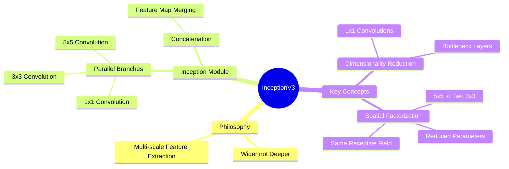
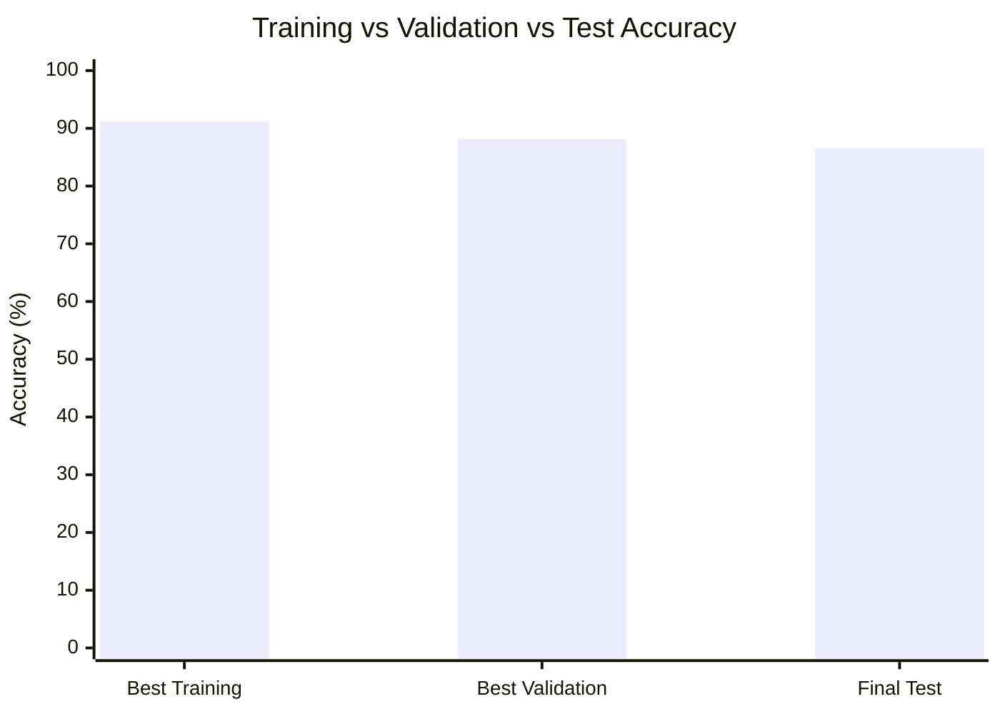
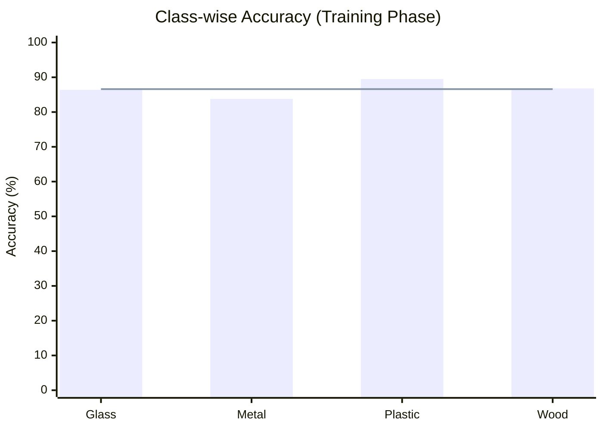

# Raw Material Classification Using Deep Learning

## Project Definition
In this project, we aim to achieve **raw material classification** using **pre-trained AI image classification models** with **transfer learning**.  
The models are implemented using **TensorFlow**, and the selected architectures are:

- EfficientNet-B1  
- MobileNetV2  
- InceptionV3  

The system classifies images into **four material classes**:
- Wood  
- Glass  
- Plastic  
- Metal  

The objective is to enable the model to learn **texture and lighting patterns** that generalize well to real-life images.

---

## Inception Architecture (Main Model)

### Introduction
**InceptionV3**, introduced by Google, follows a different design philosophy compared to traditional deep networks.  
Instead of increasing depth, Inception focuses on **increasing width** by applying **multiple filter sizes simultaneously**.

Traditional models force a single kernel size per layer, while Inception applies:
- 1×1  
- 3×3  
- 5×5 convolutions  
in parallel.

---

### Mechanism (Split–Transform–Merge)
1. **Parallel Branching**  
   Multiple convolution filters (1×1, 3×3, 5×5) operate in parallel on the same input.

2. **Concatenation**  
   Outputs from all branches are concatenated depth-wise.

This allows the network to capture **fine details** and **broad spatial features** simultaneously.

---

### Main Concepts in InceptionV3

#### 1. Dimensionality Reduction (1×1 Convolutions)
- 1×1 convolutions are used as **bottleneck layers**
- They reduce channel depth before expensive operations
- This prevents computational bottlenecks

#### 2. Spatial Factorization (V3 Specialty)
- Replaces costly 5×5 convolutions with **two stacked 3×3 convolutions**
- Reduces parameters by ~28%
- Preserves receptive field while increasing non-linearity

### InceptionV3 Visual Module

---

## MobileNetV2 & EfficientNet-B1

### A. Summaries

#### 1. MobileNetV2
A lightweight architecture designed for **mobile and edge devices**.

**Key Innovations:**
- **Inverted Residuals**  
  Structure: Narrow → Wide → Narrow  
- **Linear Bottlenecks**  
  Removes ReLU in narrow layers to preserve information

---

#### 2. EfficientNet-B1
EfficientNet demonstrates that **high accuracy does not require massive models**.

**Core Ideas:**
- **Compound Scaling (Φ)**  
  Uniform scaling of depth, width, and resolution
- **MBConv Blocks**  
  Based on MobileNetV2 inverted residuals
- **Squeeze-and-Excitation (SE)**  
  Allows the model to focus on important feature channels

---

### B. Architecture Comparisons

#### InceptionV3 vs EfficientNet
- InceptionV3: Manually hand-crafted architecture
- EfficientNet: Discovered using Neural Architecture Search (NAS)
- EfficientNet is cleaner and easier to train

#### InceptionV3 vs MobileNetV2
- EfficientNet acts as a **"Super MobileNet"**
- Adds SE layers for higher accuracy with minimal extra cost

---

## Model Comparison Table

| Feature | MobileNetV2 | InceptionV3 | EfficientNet-B1 |
|------|-----------|------------|----------------|
| Release Year | 2018 | 2015 | 2019 |
| Primary Focus | Speed & Latency | High Accuracy | Accuracy vs Size Balance |
| Model Size | ~3.4M Params | ~24M Params | ~7.8M Params |
| Core Block | Inverted Residual | Inception Module | MBConv + SE |
| Key Innovation | Linear Bottlenecks | Filter Factorization | Compound Scaling |
| Compute Cost | Very Low | High (GPU) | Low–Medium |
| Best Use Case | Mobile / Edge Devices | Server-side Accuracy | General-purpose |

---

## Dataset Aggregation & Curation

To improve generalization, a **multi-source dataset** was constructed.

### Data Sources
- **MINC-2500**  
  High-resolution texture-focused dataset
- **Garbage Classification Datasets**  
  Real-world noise and deformations
- **Google Images (Web Scraping)**  
  Used to balance classes and increase diversity

### Data Cleaning
- Manual removal of:
  - Duplicates
  - Watermarks
  - Low-quality images

---

## Challenges & Obstacles

### 1. Synthetic Overfitting
- Initial dataset contained 3D-rendered images
- Achieved misleading 99–100% accuracy
- Failed in real-world scenarios
- Dataset was discarded completely

### 2. Data Scarcity
- No unified high-quality raw material dataset
- Required extensive manual aggregation and validation

### 3. Model Selection
Evaluated multiple architectures:
- ResNet (18, 50)
- ConvNeXt
- MobileNet
- Inception
- EfficientNet (B0, B1)

Goal: balance **accuracy vs efficiency**

### 4. Optimization
- Initial training plateaued below target accuracy
- Hyperparameter tuning + architectural analysis
- Final models exceeded **80% accuracy**

---

## Results (Best Model: InceptionV3)

---

### Class-wise Accuracy (Training Phase)

---

### Classification Report

| Class | Precision | Recall | F1-score | Support |
|------|---------|-------|---------|--------|
| Glass | 0.90 | 0.86 | 0.88 | 879 |
| Metal | 0.84 | 0.84 | 0.84 | 756 |
| Plastic | 0.85 | 0.89 | 0.87 | 777 |
| Wood | 0.88 | 0.87 | 0.87 | 582 |
| **Accuracy** |  |  | **0.87** | 2994 |
| **Macro Avg** | 0.87 | 0.87 | 0.87 | 2994 |
| **Weighted Avg** | 0.87 | 0.87 | 0.87 | 2994 |

---
